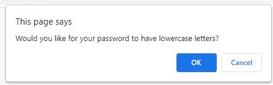

# Random Password Generator

## Table of Contents
---
- [Project Goal](##Project-Goal)
- [Links](##Links)
- [Screenshot of Webpage](##Screenshot-of-Webpage)
- [User Instructions](##User-Instructions)
- [Acknowledgements](##Acknowledgements)

## Project Goal
---
To create an application, utilizing JavaScript fundamentals, that enables the user to generate a random password based off specific parameters they select (i.e. password length and character type).  This application will run in Google Chrome and has an user-interface that is responsive to multiple screen-sizes.   

## Links
---
- ### 
- ### 

## Screenshot of Webpage
---

## User Instructions
---
1. Click red button labeled **"Generate Password"**.  

2. **Type** desired password length and press **"OK"**.  

3. Select **"OK"** if you would like **CAPITAL LETTERS** in your password. Select **"Cancel"** if not.  

4. Select **"OK"** if you would like **LOWER LETTERS** in your password. Select **"Cancel"** if not.  

5. Select **"OK"** if you would like **NUMBERS**  in your password. Select **"Cancel"** if not.  

6. Select **"OK"** if you would like **SPECIAL CHARACTERS** in your password. Select **"Cancel"** if not.  

7. **Highlight** randomly generated password and **copy** it to your clipboard.  

## Acknowledgements

The following items were provided by University of Texas at Austin Bootcamp curriculum
- [style.css](./assets/css/style.css)
- [index.html](./index.html)
- specific sections in [script.js](./assets/js/script.js) including;
    - function writePassword()
    - button event listener